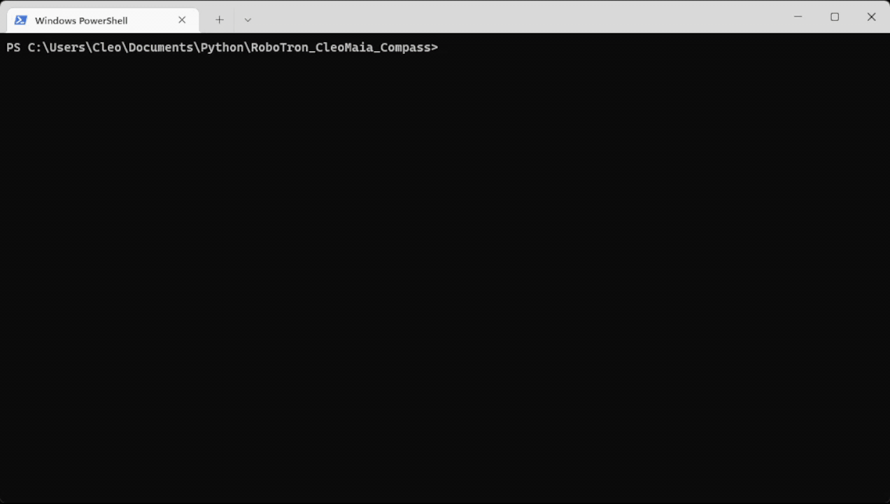

# Challagen Sprint 4
[](./LICENSE)

### Esse repositório foi criado para apresentação da lista de exercícios da challange do sprint 4.

### Ele conte duas listas de exercícios desenvolvidos em python:


### Exercícios dia 5:
Contem 12 exercícios de raciocínio lógico.


### Exercícios dia 7:
Contem 16 exercícios de  manipulação de arquivos nos formatos json e csv.

## instalação

```bash
pip install requirements.txt
```

## Uso
Os exercícios podem ser executados de duas formas

```bash
# Primeira forma menu interativo 
#Execute o arquivo main que vai abrir o menu para seleção de exercíos.
python main.py
```



```bash
# Segunda forma execução direta do exercício
#Execute o exercício desejado, exemplo:
python Exercicios_Dia_5/Exercicio_1.py
```
## Autor
Cléo Maia Cordeiro

https://www.linkedin.com/in/cleocordeiro/

